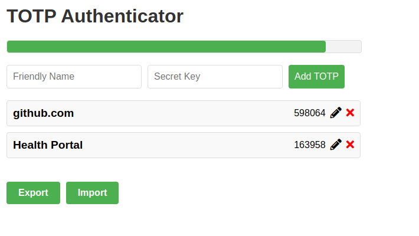

# TOTP Authenticator

## About
An RFC 6238 TOTP authenticator. This can be used as a web application unlike apps like Google Authenticator.




## Functionality
- Add token
- Edit token secret key
- Delete token
- Export data as JSON
- Import (and overwrite) data from JSON

## Security
All data, including secret keys, are stored in browser local storage. This is inherently insecure and therefore
use this application at your own risk, ensuring to protect access to your filesystem where this is stored.

## How to build
```
npm install
npm run build
```
Open `./dist/index.html` in a browser.

## Compatability
This has only been tested with Google Chrome, however it should work with other browsers.
